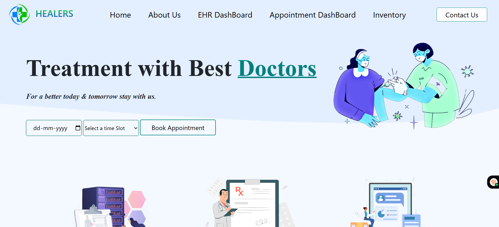
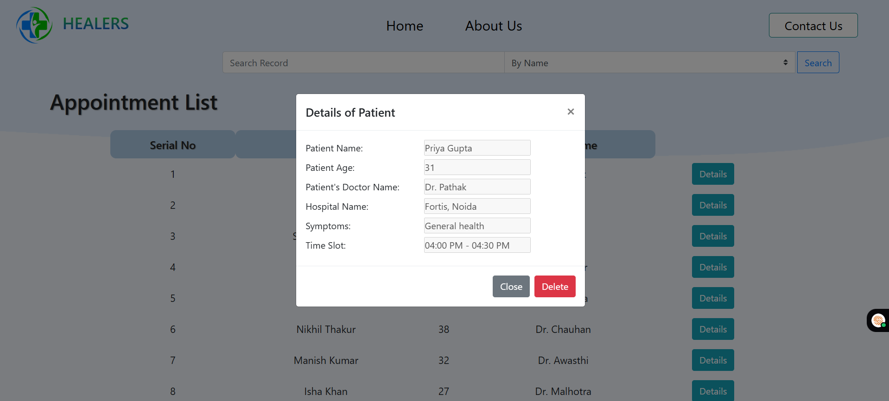

# 🏥 Patient Appointment Booking Portal

A responsive and minimal appointment booking system for hospitals and clinics. This project helps manage patient data, appointment times, doctor assignments, and basic hospital records using a clean frontend and real-time backend powered by Firebase Firestore.

---

## 🔗 Live Demo

👉 [Try the app here](https://patientappointmentbooking.netlify.app)

---

## 📌 Features

- 📄 View all appointments in a clean table layout
- 🔍 Search by:
  - Patient name
  - Age
  - Doctor name
- 👁️ View full appointment details in a modal
- ❌ Delete a patient record from Firestore
- ☁️ Real-time data syncing with Firebase
- ⚙️ Built fully in vanilla HTML, CSS, and JavaScript

---

## 🛠️ Tech Stack

| Category   | Tools Used                         |
|------------|-------------------------------------|
| Frontend   | HTML, CSS, JavaScript (no framework) |
| Styling    | Bootstrap 4, Custom CSS             |
| Database   | Firebase Firestore                  |
| Hosting    | Netlify                             |

---

## 📷 Screenshots

### 🖥️ Home Page

### 🗂️ Appointment DashBoard

---

## 🚀 Future Improvements

- Add patient registration form
- User login (admin-only access to delete or edit)
- Doctor-wise appointment filtering
- Export appointments to PDF or CSV

---

## 👨‍💻 Author

**Akshat Jain**  
📎 [LinkedIn](https://www.linkedin.com/in/akshat-jain-b016391a6/)  
💻 [GitHub](https://github.com/AkshatJain447)

---

## 📝 License

This project is open-source and free to use for educational or demonstration purposes.
